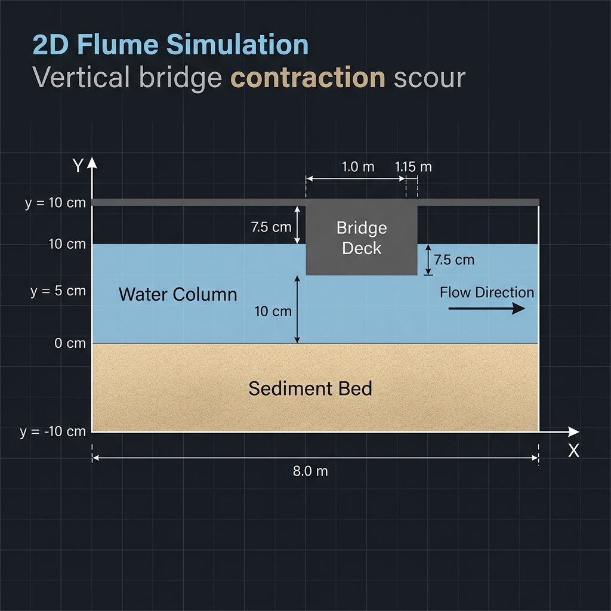

# Computational Fluid Dynamics (CFD) Report: Erodible-Bed Pressure Flow Scour due to Vertical Bridge Contraction

This repository contains the OpenFOAM (v2412) implementation, grid setup, and parallel run configurations designed to model vertical bridge contraction scour over an erodible sediment bed. By utilizing the high-fidelity two-phase solver **`sedFoam_rbgh`**, this model transitions from simplified rigid-bed wall functions to a fully resolved sediment transport, erodible bed deformation, and morphological scour evolution.

---

## 1. Governing Physical Theory

### 1.1 Two-Phase Saturated Hydrodynamic Solver
The flow solver operates on the two-phase Eulerian-Eulerian formulation where the fluid phase ($b$) and sediment/granular phase ($a$) satisfy:
$$\alpha_a + \alpha_b = 1.0$$

The phase-volume averaged Navier-Stokes equations are solved with inter-phase drag forces (using the Gidaspow-Schiller-Naumann formulation) and a shared pressure field:
$$\frac{\partial (\alpha_i \rho_i \mathbf{U}_i)}{\partial t} + \nabla \cdot (\alpha_i \rho_i \mathbf{U}_i \mathbf{U}_i) = -\alpha_i \nabla p + \nabla \cdot (\alpha_i \tau_i) + \alpha_i \rho_i \mathbf{g} + \mathbf{M}_{ji}$$

*Where $\mathbf{M}_{ji}$ represents the momentum transfer (drag and lift forces) between the fluid and sediment phases.*

### 1.2 Granular Stress & Rheology Model
Particle-particle interactions and erodible bed stability are modeled using the **$\mu(I)$ rheology framework** (Boyer et al. formulation):
- **Particulate Pressure ($p_a$)**: Prevents the sediment phase volume fraction from exceeding the packing limit ($\alpha_{\text{max}} = 0.635$).
- **Friction Coefficient ($\mu(I)$)**: Governs transition from quasi-static to inertial flow regimes based on the inertial number $I$.
- **Dilatancy Angle ($\delta$)**: Dimensionless parameter representing vertical expansion/contraction under shear deformation, resolved dynamically by the granular rheology solver.

---

## 2. Computational Mesh & Case Setup

### 2.1 Spatial Discretization & Mesh Optimizations
A structured multi-block hexahedral grid was developed to resolve boundary layers and high-gradient zones (bed boundary layer, contraction entrance, and ceiling boundary layers):
- **Domain Dimensions**: $8.0\text{ m}$ (Length) $\times$ $0.20\text{ m}$ (Height) $\times$ $0.01\text{ m}$ (Width, 2D slice).
- **Sediment Bed**: Extends from $y = -0.10\text{ m}$ to $y = 0.0\text{ m}$ ($10\text{ cm}$ erodible depth).
- **Water Column**: Extends from $y = 0.0\text{ m}$ to $y = 0.10\text{ m}$ ($10\text{ cm}$ clear height).
- **Bridge Contraction Zone**: Ceils the flow from $x = 1.0\text{ m}$ to $x = 1.15\text{ m}$ ($L = 0.15\text{ m}$) with a ceiling block from $y = 0.075\text{ m}$ to $y = 0.10\text{ m}$ (clear throat height $H_b = 0.075\text{ m}$).
- **Mesh Density**: **110,300 cells** (1 cell thick in $Z$).
- **Near-Wall Resolution**: The vertical grading is optimized to refine grid cells near boundaries where high velocity gradients exist:
  - **Sediment-Water Interface ($y = 0.0\text{ m}$)**: Cell size refined down to $y_{\text{first}} \approx 0.22\text{ mm}$, yielding a dimensionless wall distance of $y^+ \approx 1.4$, placing the first cell well inside the viscous sublayer ($y^+ < 5$).
  - **Bridge Ceiling ($y = 0.075\text{ m}$)**: Refined using grading to capture wall-bounded shear layers.

### 2.2 Boundary Conditions (BCs)

| Field | description | Inlet | Bed (Bottom Wall) | Top Lid | Bridge Ceiling |
|:---|:---|:---|:---|:---|:---|
| **`alpha.a`** | Sediment Fraction | Coded profile ($\alpha_a=0.60$ for $y \le 0$) | `zeroGradient` | `zeroGradient` | `zeroGradient` |
| **`alpha.b`** | Fluid Fraction | Coded profile ($\alpha_b=0.40$ for $y \le 0$) | `zeroGradient` | `zeroGradient` | `zeroGradient` |
| **`U.a`** | Sediment Velocity | `fixedValue` uniform $(0, 0, 0)$ | `noSlip` | `slip` | `noSlip` |
| **`U.b`** | Fluid Velocity | `codedFixedValue` (1/7th power law) | `noSlip` | `slip` | `noSlip` |
| **`p_rbgh`** | Shared Pressure | `zeroGradient` | `zeroGradient` | `slip` | `zeroGradient` |
| **`k.b`** | Fluid TKE | `codedFixedValue` ($k = 2.535 \times 10^{-4}$) | `kqRWallFunction` | `slip` | `kqRWallFunction` |
| **`omega.b`**| Fluid Dissipation | `codedFixedValue` ($\omega = 4.153$) | `omegaWallFunction`| `slip` | `omegaWallFunction` |
| **`nut.b`** | Fluid Viscosity | `calculated` | `nutkWallFunction` | `slip` | `nutkWallFunction` |

---

## 3. Geometry & Domain Schematic

Below is the side-view schematic (X-Y plane) of the simulation domain showing the erodible sediment bed, the water column, and the bridge constriction zone:



---

## 4. Execution & High-Performance Computing (HPC)

The simulation uses parallel decomposition to optimize runtime. Given the mesh size (~110,000 cells), the domain is divided into **8 subdomains** (~13,800 cells per core) to maintain peak parallel scaling efficiency and minimize MPI communication overhead.

### 4.1 Running the Case
The execution script clean-builds the mesh, initializes fields, partitions the domain, and starts the solver:
```bash
./Allrun
```

### 4.2 Resetting Case Files
To delete all generated mesh, processor subdirectories, logs, and time-step fields:
```bash
./Allclean
```

### 4.3 Monitoring Simulation Progress
Use the following command to track solver convergence and physical time-step scaling:
```bash
tail -f log.sedFoam_rbgh
```
